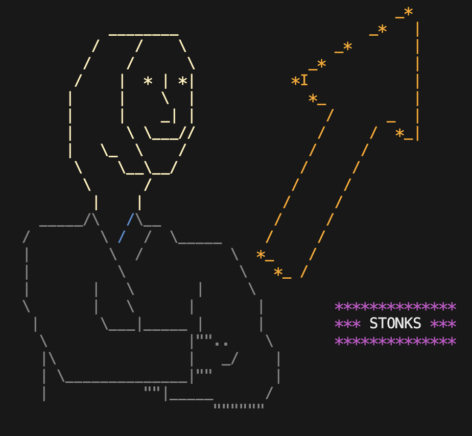

# Description

This package lets you show stonks meme guy
in your console whenever and wherever you
need.

Your code works? Show it!\
Your tests pass? Show it!\
Your tests don't pass? Show it anyway (why not)

# How to use it

Surprisingly, this package is very easy to use.\
You only need to import the lib like this:
```
const { showStonksGuy } = require('@pznamir00/stonks');
```
Then you are ready to use the function
```
showStonksGuy();
```

If you like using async functions, let's do the following
```
const { showStonksGuyAsync } = require('@pznamir00/stonks');
...
await showStonksGuyAsync();
```

# Example output

